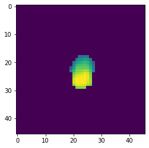

[](https://opensource.org/licenses/MIT)

# Create cell thumbnails

Module for creating thumbnail images of all cells given a image and segmentation mask.

## Installation

```
pip install git+https://github.com/labsyspharm/cellcutter.git#egg=cellcutter
```

## Usage

```
cut_cells [-h] [-p P] [-z] [--window-size WINDOW_SIZE] [--mask-cells]
                 [--chunk-size CHUNK_SIZE] [--cache-size CACHE_SIZE]
                 [--channels [CHANNELS ...]]
                 IMAGE SEGMENTATION_MASK CELL_DATA DESTINATION

Cut out thumbnail images of all cells. Thumbnails will be stored as Zarr array
(https://zarr.readthedocs.io/en/stable/index.html) with dimensions [#channels, #cells,
window_size, window_size]. The chunking shape greatly influences performance
https://zarr.readthedocs.io/en/stable/tutorial.html#chunk-optimizations.

positional arguments:
  IMAGE                 Path to image in TIFF format, potentially with multiple
                        channels. Thumbnails will be created from each channel.
  SEGMENTATION_MASK     Path to segmentation mask image in TIFF format. Used to
                        automatically chose window size and find cell outlines.
  CELL_DATA             Path to CSV file with a row for each cell. Must contain columns
                        CellID (must correspond to the cell IDs in the segmentation
                        mask), Y_centroid, and X_centroid (the coordinates of cell
                        centroids).
  DESTINATION           Path to a new directory where cell thumbnails will be stored in
                        Zarr format.

options:
  -h, --help            show this help message and exit
  -p P                  Number of processes run in parallel.
  -z                    Store thumbnails in a single zip file instead of a directory.
  --window-size WINDOW_SIZE
                        Size of the cell thumbnail in pixels. Defaults to size of
                        largest cell.
  --mask-cells          Fill every pixel not occupied by the target cell with zeros.
  --chunk-size CHUNK_SIZE
                        Desired uncompressed chunk size in MB. (See
                        https://zarr.readthedocs.io/en/stable/tutorial.html#chunk-
                        optimizations) Since the other chunk dimensions are fixed as
                        [#channels, #cells, window_size, window_size], this argument
                        determines the number of cells per chunk. (Default: 32 MB)
  --cache-size CACHE_SIZE
                        Cache size for reading image tiles in MB. For best performance
                        the cache size should be larger than the size of the image.
                        (Default: 10240 MB = 10 GB)
  --channels [CHANNELS ...]
                        Indices of channels (1-based) to include in the output e.g.,
                        --channels 1 3 5. Default is to include all channels. This
                        option must be *after* all positional arguments.
```

## Example

Example data are available for [download at mcmicro.org](https://mcmicro.org/datasets.html).

```
cut_cells exemplar-001/registration/exemplar-001.ome.tif \
  exemplar-001/segmentation/unmicst-exemplar-001/cellMask.tif \
  exemplar-001/quantification/unmicst-exemplar-001_cellMask.csv \
  cellMaskThumbnails.zarr
```

## Reading the zarr array output

```python
import zarr
from matplotlib import pyplot as plt
```

```python
x = zarr.open("cellMaskThumbnails.zarr", mode = "r")
```

    <zarr.core.Array (12, 9522, 46, 46) uint16 read-only>

```python
plt.imshow(x[0, 0, ...])
```



```python
plt.figure(figsize=(10, 10))
for i in range(64):
    ax = plt.subplot(8, 8, i + 1)
    ax.axis("off")
    ax.imshow(x[0, i, ...])
plt.tight_layout()
```


## Performance

Zarr arrays are [chunked](https://zarr.readthedocs.io/en/stable/tutorial.html?highlight=chunk#chunk-optimizations), meaning that they are split up into small pieces of equal size, and each chunk is stored in a separate file. Choice of the chunk size affects performance significantly.

Performance will also vary quite a bit depending on the access pattern. Slicing the array so that only data from a single chunk needs to be read from disk will be fast while array slices that cross many chunks will be slow.

An overview of some chunking performance considerations are [available here](https://www.oreilly.com/library/view/python-and-hdf5/9781491944981/ch04.html).

By default, *cellcutter* creates Zarra arrays with chunks of the size `[channels in TIFF, x cells, thumbnail width, thumbnail height]`, meaning for a given cell, all channels and the entire thumbnail image are stored in the same chunk. The number of cells `x` per chunk is calculated internally so that each chunk has a total uncompressed size of about 32 MB.

The default chunk size works well for access patterns that request all channels and the entire thumbnail for a given range of cells. Ideally, the cells should be contiguous along the second dimension of the array.

```python
import itertools
import zarr
import pandas as pd
import numpy as np
from matplotlib import pyplot as plt
from numcodecs import Blosc
```


```python
z = zarr.open("cellMaskThumbnails.zarr", mode="r")
```


```python
z.shape
```


    (12, 9522, 46, 46)


```python
z.chunks
```


    (12, 330, 46, 46)


The `chunks` property gives the size of each chunk in the array. In this example, all 12 channels, 330 cells, and the complete thumbnail are stored in a single chunk.

### Access patterns

#### 100 Random cells


```python
from numpy.random import default_rng
rng = default_rng()
def rand_slice(n=100):
    return rng.choice(z.shape[1], size=n, replace=False)
```


```python
%%timeit
_ = z.get_orthogonal_selection((slice(None), rand_slice()))
```

    109 ms ± 2.9 ms per loop (mean ± std. dev. of 7 runs, 10 loops each)


#### 100 Contiguous cells


```python
%%timeit
_ = z[:, 1000:1100, ...]
```

    4.13 ms ± 139 µs per loop (mean ± std. dev. of 7 runs, 100 loops each)


Accessing **100 random cells** from the Zarr array takes around 110 ms whereas accessing **100 contiguous cells** (cell 1000 to 1100) only takes around 4 ms — an almost 30-fold speed difference. This is because random cells are likely to be distributed across many separate chunks. All these chunks need to be read into memory in full even if only a single cell is requested for a given chunk. In contrast, contiguous cells are stored together in one or several neighboring chunks minimizing the amount of data that has to be read from disk.

### Fast access to random cells

If access to random cells is required, for example for training a machine learning model, there is a workaround avoiding the performance penalty of requesting random cells. Instead of truly accessing random cells we can instead randomize cell order before the Zarr array is created. Because cell order is random we can then simply request contiguous cells during training.

The simplest way to randomize cell order is to shuffle the order of rows in the CSV file that is passed to *cellcutter*, for example by using *pandas* `df.sample(frac=1)`.


## Funding

This work is supported by the following:

* NCI grants U54-CA22508U2C-CA233262 and U2C-CA233280
* NIH grant 1U54CA225088: Systems Pharmacology of Therapeutic and Adverse Responses to Immune Checkpoint and Small Molecule Drugs
